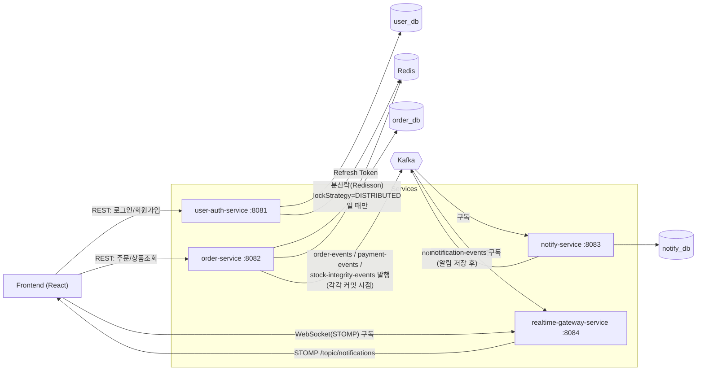
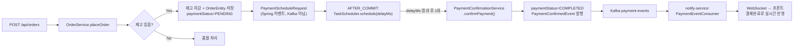
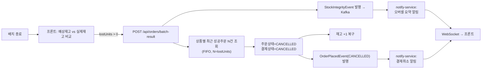

# notiflow

Kafka 기반 이벤트 처리와 락 없음/DB 락(Pessimistic)/분산락(Redisson) 세 가지 동시성 제어 전략을 직접 구현/검증해보기 위해 만든 MSA 포트폴리오 프로젝트입니다.

"동시에 몰리는 주문에서 재고가 왜 깨지는지", "그걸 막으면 무엇이 달라지는지", "처리 결과를 실시간으로 어떻게 전달하는지"를 최소 구성으로 직접 만들어서 눈으로 확인하는 데 초점을 맞췄습니다.

## 데모 시나리오

1. 프론트에서 100/500/1000건 규모의 동시 주문을 시뮬레이션으로 쏩니다.
2. **락 전략(NONE / PESSIMISTIC / DISTRIBUTED)** 중 하나를 골라서 같은 부하로 여러 번 돌려봅니다.
   - `NONE`: 락 없이 조회 후 차감 → 동시 요청이 겹치면서 lost update(오버셀) 재현
   - `PESSIMISTIC`: DB `SELECT ... FOR UPDATE`로 같은 SKU 요청을 순차화 → 예상 재고와 실제 재고가 항상 일치
   - `DISTRIBUTED`: Redisson 분산락으로 애플리케이션 레이어에서 순차화 → DB 락 없이도 동일한 결과 재현
3. 주문 성공 건은 구매자별 랜덤 지연(300ms~8s) 후 결제가 확정됩니다(`결제대기 → 결제완료`). 재고 차감은 여전히 주문 시점에 동기로 끝나고, 결제는 그 뒤에 붙는 순수 후처리 상태 전환이라 락 경합 비교(응답시간)에는 영향을 주지 않습니다.
4. `NONE`으로 돌려서 오버셀이 발생하면, 상품별로 가장 최근 성공 주문부터 오버셀 수량만큼 자동으로 취소됩니다(재고 복구 + 결제취소 알림) — 실무에서 오버셀 발견 시 뒤늦게 확정된 주문을 취소/환불하는 것과 같은 원리의 보상 트랜잭션입니다.
5. 처리된 주문/결제확정/취소는 모두 Kafka를 거쳐 알림으로 가공되고, WebSocket(STOMP)으로 화면에 실시간으로 꽂힙니다.

## 아키텍처



같은 JWT(`jwt.secret` 공유)를 order-service가 그대로 검증하는 방식으로 인증을 최소 구성했고, 서비스 간 직접 호출 대신 Kafka로 결합도를 낮췄습니다. DB는 서비스별로 분리(`user_db` / `order_db` / `notify_db`)해서 데이터 소유권을 서비스 안에 가둬뒀습니다. Redis는 user-auth-service(Refresh Token)와 order-service(분산락) 양쪽에서 쓰지만 용도가 완전히 달라서 키 네임스페이스가 겹치지 않습니다.

## 모듈 구성

Gradle 멀티모듈이며, 서비스 간 공통 코드는 `common`에 모아두고 각 서비스가 이를 의존합니다.

```
notiflow/
├── common/                    # 서비스 전체가 공유하는 코드
├── user-auth-service/         # 회원가입/로그인/로그아웃 (:8081)
├── order-service/             # 주문 처리 + 락 3종 비교 + 결제 시뮬레이션 + 오버셀 사후 취소 (:8082)
├── notify-service/            # Kafka 소비 → 알림 가공/저장 (:8083)
├── realtime-gateway-service/  # Kafka 소비 → WebSocket 브로드캐스트 (:8084)
└── docker-compose.yml         # 로컬 개발용 Kafka + Redis
```

### common — 공유 모듈

| 클래스 | 역할 |
|---|---|
| `security.jwt.JwtTokenProvider` | JWT 발급/검증. `user-auth-service`가 발급하고, `order-service`는 같은 secret으로 검증만 함(재발급 없음) |
| `security.jwt.JwtAuthenticationFilter` | `Authorization: Bearer` 헤더를 읽어 SecurityContext에 인증 정보를 채우는 필터. 각 서비스의 `SecurityConfig`가 직접 등록 |
| `security.config.CommonSecurityConfig` | 자체 인증 로직이 없는 서비스(notify, gateway)용 기본 Security 설정(permitAll + CORS). 자체 `SecurityConfig`를 갖는 서비스(user-auth, order)는 컴포넌트 스캔에서 이 클래스를 제외 |
| `response.ApiResponse` / `ResponseResult` | `{ code, message, data }` 형태로 통일한 공통 응답 포맷. 응답 코드/메시지는 Enum(`ResponseResult`)으로 관리 |
| `handler.RespExcpHandler` | `@RestControllerAdvice(basePackages = "com.seokwon.notiflow")`로 전체 서비스의 예외를 한 곳에서 `ApiResponse` 형태로 변환 |
| `exception.BusinessException` / `NotFoundException` | 도메인 예외. `RespExcpHandler`가 이걸 받아 적절한 HTTP 상태로 변환 |
| `kafka.KafkaTopics` | Kafka 토픽 이름 상수(`order-events`, `notification-events`). Producer/Consumer가 문자열을 직접 들고 있지 않고 여기서 공유 |

각 서비스는 `@ComponentScan(basePackages = "com.seokwon.notiflow")`로 `common`의 컴포넌트를 그대로 끌어와 씁니다. 대신 서비스마다 필요 없는 공용 Bean(예: 자체 Security 설정이 있는 서비스에서 `CommonSecurityConfig`)은 `excludeFilters`로 명시적으로 제외합니다.

### user-auth-service — 인증

```
userauth/
├── UserController        POST /api/users/signUp, /login, /logout/{userNo}
├── UserService            회원가입/로그인/로그아웃 비즈니스 로직
├── UserEntity              users 테이블
├── UserRepository
├── config/SecurityConfig   signUp·login만 permitAll, 나머지는 JWT 인증 필요
├── config/RedisConfig      Lettuce 기반 StringRedisTemplate
├── redis/RedisService      Refresh Token 저장/조회/삭제 (key: refresh:{userId})
└── dto/                    LoginRequestDTO, LoginResponseDTO, SignUpRequestDTO, SignUpResponseDTO
```

로그인 성공 시 `JwtTokenProvider`로 Access/Refresh Token을 발급하고, Refresh Token은 DB가 아닌 **Redis**에 저장합니다(세션 조회 병목 회피, 로그아웃 시 즉시 무효화 가능). DB는 `user_db`.

### order-service — 주문 + 동시성 데모

```
order/
├── OrderController                        GET /api/orders/products, POST /api/orders,
│                                           POST /api/orders/reset, POST /api/orders/batch-result
├── service/OrderService                    주문 처리 + 오버셀 사후 취소 + Kafka 이벤트 발행
├── service/ProductService                  상품/재고 목록 조회
├── service/PaymentConfirmationService      결제 확정 처리 전용(타이머가 호출, self-invocation 방지용 분리 빈)
├── service/DistributedLockService          Redisson 락 획득/해제 실행기(executeWithLock)
├── entity/ProductEntity                    상품 모델(예: Galaxy Z Flip8)
├── entity/ProductDetailEntity              실제 판매 단위(SKU) - 용량+색상 조합별 재고. 락 대상
├── entity/CustomerEntity                   시뮬레이션용 테스트 구매자 풀(2,000명)
├── entity/OrderEntity                      주문 처리 이력 + 결제상태(paymentStatus/paymentDueAt/paymentConfirmedAt)
├── entity/OrderStatus                      SUCCESS / OUT_OF_STOCK / CANCELLED
├── entity/PaymentStatus                    PENDING / COMPLETED / CANCELLED
├── entity/LockStrategy                     NONE / PESSIMISTIC / DISTRIBUTED
├── repository/ProductDetailRepository      findByIdForUpdate (PESSIMISTIC_WRITE)
├── repository/OrderRepository              findRecentSuccessOrders (오버셀 취소 대상 조회, FIFO)
├── event/OrderPlacedEvent, PaymentConfirmedEvent,
│         StockIntegrityEvent, PaymentScheduleRequest   Kafka 발행용 + 인프로세스 전용(PaymentScheduleRequest) 이벤트
├── event/OrderEventPublisher                @TransactionalEventListener(AFTER_COMMIT)로 Kafka 발행 + 타이머 예약
├── config/RedissonConfig                    분산락용 RedissonClient 빈
├── config/SchedulingConfig                  결제 확정 타이머용 TaskScheduler 빈
├── seed/ProductSeeder, TestBuyerSeeder       상품/재고, 테스트 구매자 2,000명 시드
└── config/SecurityConfig                    상품 목록(GET)만 공개, 나머지는 JWT 인증 필요
```

**락 전략 3종** (`OrderService.placeOrder(detailId, buyerUserNo, lockStrategy)`)

```java
ProductDetailEntity detail = (lockStrategy == LockStrategy.PESSIMISTIC
        ? productDetailRepository.findByIdForUpdate(detailId)   // PESSIMISTIC_WRITE, 순차 처리
        : productDetailRepository.findById(detailId))            // 락 없음
        .orElseThrow(...);
```

`NONE`과 `DISTRIBUTED`는 이 메서드 안에서는 똑같이 락 없는 조회를 씁니다. `DISTRIBUTED`의 직렬화는 이 메서드 "바깥"(`OrderController`)에서 이미 끝나 있는 상태여야 하기 때문입니다.

```java
// OrderController.placeOrder - DISTRIBUTED만 별도 빈(DistributedLockService)으로 감싸서 호출
OrderResultDTO result = lockStrategy == LockStrategy.DISTRIBUTED
        ? distributedLockService.executeWithLock("stock-lock:" + detailId,
                () -> orderService.placeOrder(detailId, buyerUserNo, lockStrategy))
        : orderService.placeOrder(detailId, buyerUserNo, lockStrategy);
```

`DistributedLockService`가 `OrderService`와 별도의 Spring 빈인 이유는, 같은 빈 안에서 `this.placeOrder(...)`처럼 자기 자신을 호출(self-invocation)하면 `@Transactional` 프록시를 거치지 않아 트랜잭션이 아예 안 걸리기 때문입니다. 반드시 다른 빈(Controller)이 프록시를 거쳐 호출해야, 락을 해제하는 시점에 DB 커밋까지 끝난 상태가 보장됩니다.

세 전략 모두 동일한 인위적 지연(`Thread.sleep(40ms)`)을 거치게 해서, "락이 있어서 느린 것"이 아니라 "같은 조건에서 락 방식 차이 자체가 결과를 가른다"를 공정하게 비교할 수 있게 했습니다.

**이벤트 발행은 `ApplicationEventPublisher` → `@TransactionalEventListener(AFTER_COMMIT)`을 거칩니다.** `OrderService`가 트랜잭션 안에서 곧바로 `KafkaTemplate`을 호출하면, DB 트랜잭션이 롤백되더라도 이미 Kafka로 나간 메시지는 취소할 수 없는 **dual-write 문제**가 생깁니다. 그래서 `OrderPlacedEvent`/`PaymentConfirmedEvent`/`StockIntegrityEvent` 모두 트랜잭션 커밋 이후에만 실제로 Kafka에 발행되도록 분리했습니다.

**결제 시뮬레이션.** 주문 성공 건은 그 시점에 구매자별 랜덤 지연(300ms~8s, `ThreadLocalRandom`)을 확정하고, `PaymentScheduleRequest`(Kafka로 나가지 않는 순수 인프로세스 이벤트)를 통해 `OrderEventPublisher`가 AFTER_COMMIT 시점에 `TaskScheduler`로 그 지연시간 뒤 딱 한 번 실행될 타이머를 겁니다. DB를 주기적으로 폴링하지 않는 이유는, 지연시간을 우리가 직접 만들어서 이미 정확히 알고 있으므로 폴링/수신대기 없이 바로 예약이 가능하기 때문입니다(대신 인메모리 타이머라 서비스 재시작 시 예약이 유실되는 트레이드오프는 있음). 타이머가 만료되면 `PaymentConfirmationService.confirmPayment()`가 `paymentStatus=COMPLETED`로 갱신하고 `PaymentConfirmedEvent`를 발행합니다. 이 메서드가 `OrderService`가 아닌 별도 빈인 이유도 위와 동일한 self-invocation 문제 때문입니다.

**오버셀 사후 취소(보상 트랜잭션).** 배치 종료 후 프론트가 예상 재고와 실제 재고를 비교해 오버셀(`lostUnits > 0`)을 감지하면 `POST /api/orders/batch-result`로 상품별 오버셀 수량을 보고합니다. `OrderService.reportBatchResult`는 `StockIntegrityEvent`를 발행하는 것과 별개로, 상품별로 `findRecentSuccessOrders`(가장 최근 성공 주문부터, FIFO)를 오버셀 수량만큼 조회해서 주문상태/결제상태를 모두 `CANCELLED`로 바꾸고 재고를 복구합니다. "누가 오버셀의 원인인지"는 알 수 없기 때문에, 실무에서 오버셀 발견 시 뒤늦게 확정된 주문부터 취소/환불하는 방식을 그대로 따른 것입니다.

DB는 `order_db`.

### notify-service — 알림 가공/저장

```
notify/
├── consumer/OrderEventConsumer            order-events 구독 → 알림 문구 생성 → DB 저장 → notification-events 발행
├── consumer/PaymentEventConsumer          payment-events 구독 → 결제 확정 알림
├── consumer/StockIntegrityEventConsumer   stock-integrity-events 구독 → 오버셀/취소 요약 알림(우선순위 고정)
├── entity/NotificationEntity              notify 테이블(orderId, category, message, isRead, createdAt)
├── repository/NotificationRepository
└── event/
    ├── OrderPlacedEvent, OrderStatus, PaymentConfirmedEvent,
    │     StockIntegrityEvent, OversoldProduct, LockStrategy   order-service 이벤트들의 자체 사본
    └── NotificationPublishedEvent                              저장 완료된(표시용) 알림 이벤트
```

order-service의 이벤트 클래스를 그대로 가져다 쓰지 않고, **필드 구조만 동일한 별도 클래스를 자체적으로 보유**합니다. 서비스 간에 클래스를 공유하면 한쪽이 필드를 바꿀 때 다른 쪽이 컴파일 타임에 깨지지 않고 런타임에 조용히 역직렬화 실패하는 결합이 생기기 때문입니다. Kafka 메시지도 `spring.json.add.type.headers=false`로 producer 클래스의 풀패키지명을 헤더에 싣지 않고, 리스너마다 `spring.json.value.default.type` 프로퍼티를 오버라이드해서(`@KafkaListener(properties = "...")`) 토픽별로 자기 소유 클래스에 고정 매핑합니다 — 컨슈머 팩토리 하나를 4개 토픽(`order-events`/`payment-events`/`stock-integrity-events`/`notification-events`)이 공유하면서도 페이로드 타입이 서로 다른 문제를 이렇게 격리합니다.

DB 저장이 끝나면 같은 메서드 안에서 바로 `notification-events`를 발행합니다(`NotificationRepository.save()`가 Spring Data JPA 자체 트랜잭션으로 즉시 커밋되므로, order-service 때와 달리 별도의 AFTER_COMMIT 처리가 필요 없습니다). DB는 `notify_db`.

### realtime-gateway-service — 실시간 브로드캐스트

```
gateway/
├── config/WebSocketConfig               STOMP 엔드포인트(/ws, SockJS) + 메시지 브로커(/topic)
├── consumer/NotificationEventConsumer   notification-events 구독 → /topic/notifications로 즉시 브로드캐스트
└── event/NotificationPublishedEvent     notify-service 이벤트의 자체 사본
```

가공/판단 로직 없이 받은 그대로 중계만 합니다. 별도 REST 트리거 대신 **Kafka를 직접 구독**하게 해서 notify-service와 REST로 얽히지 않도록 했고, 둘 중 하나가 잠깐 죽어도 Kafka가 메시지를 들고 있다가 재연결 시 이어받습니다.

## 실시간 알림 파이프라인 (전체 흐름)

```
1. 프론트  → POST /api/orders  (order-service)
2. OrderService.placeOrder()
     - lockStrategy(NONE/PESSIMISTIC/DISTRIBUTED) 분기로 재고 차감
     - OrderEntity 저장 (주문 성공 건은 paymentStatus=PENDING)
     - ApplicationEventPublisher.publishEvent(OrderPlacedEvent)   ← 트랜잭션 안, 아직 Kafka로 안 나감
3. 트랜잭션 커밋 완료
     - OrderEventPublisher(@TransactionalEventListener AFTER_COMMIT)가 그제서야 Kafka "order-events"로 발행
4. notify-service: OrderEventConsumer가 order-events 구독
     - 상태(주문/품절/결제취소)에 맞는 알림 문구 생성
     - NotificationEntity 저장 (notify_db)
     - Kafka "notification-events"로 재발행
5. realtime-gateway-service: NotificationEventConsumer가 notification-events 구독
     - SimpMessagingTemplate으로 "/topic/notifications" 브로드캐스트
6. 프론트: STOMP 구독 중인 notificationStore가 메시지 수신 → 알림 위젯 + 그리드에 실시간 반영
```

### 결제 확정 흐름

주문 성공 건에 한해, 그 트랜잭션 커밋 직후 구매자별 랜덤 지연(300ms~8s)만큼 딱 한 번 실행되는 타이머가 예약되고, 그 타이머가 만료되면 결제 확정 이벤트가 같은 파이프라인(Kafka → notify-service → WebSocket)을 탑니다.



### 오버셀 사후 취소 흐름

`NONE` 전략으로 오버셀이 발생했을 때만 타는 보상 트랜잭션 경로입니다.



## 로컬 실행

### 1. 인프라 (Kafka + Redis)

```bash
cd backend
docker compose up -d
docker compose ps
```

### 2. 데이터베이스

서비스별로 DB를 분리해서 씁니다. 아직 없다면 먼저 생성합니다.

```sql
CREATE DATABASE user_db;
CREATE DATABASE order_db;
CREATE DATABASE notify_db;
```

각 서비스는 `DB_URL` 환경변수로 자신의 DB를 가리키게 되어 있습니다(설정 안 하면 기본값 `devdb`로 떨어짐).

| 서비스 | 환경변수 예시 |
|---|---|
| user-auth-service | `DB_URL=jdbc:postgresql://<host>:5432/user_db` |
| order-service | `DB_URL=jdbc:postgresql://<host>:5432/order_db` |
| notify-service | `DB_URL=jdbc:postgresql://<host>:5432/notify_db` |
| realtime-gateway-service | 엔티티가 없어 필수는 아니지만, datasource 설정 자체는 붙어있어 접속 가능한 DB 지정 필요 |

공통으로 필요한 환경변수: `DB_USERNAME`, `DB_PASSWORD`, `JWT_SECRET`(HS256 요구사항상 **32자 이상** 필수 - 짧으면 `WeakKeyException`으로 기동 실패).

### 3. 서비스 기동 순서

Kafka/Redis → user-auth-service → order-service → notify-service → realtime-gateway-service 순으로 띄우는 걸 권장합니다(주문/알림 파이프라인이 서로를 필요로 하므로).

| 서비스 | 포트 |
|---|---|
| user-auth-service | 8081 |
| order-service | 8082 |
| notify-service | 8083 |
| realtime-gateway-service | 8084 |

## 기술 스택

**Backend**: Java 21, Spring Boot 3.3.7, Spring Data JPA, Spring Security, Spring Kafka, Spring WebSocket(STOMP), Redis(Lettuce), Redisson(분산락), PostgreSQL, JWT(jjwt), Gradle 멀티모듈

**Infra(로컬 개발)**: Docker Compose (Kafka - KRaft 단일 브로커, Redis)

**Frontend**: React, TypeScript, Zustand, Axios, @stomp/stompjs + SockJS — 자세한 내용은 [portfolio-front](https://github.com/KSW0927/portfolio-front) 참고
